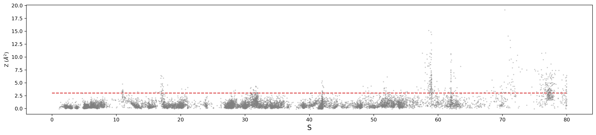

# Assessing the guessed path

We can now use the *REPARAM.pdb* file as reference path for Path CVs. However, it is advisable to run some diagnostics to evaluate its reliability before utilizing it for resampling. For instance, we can see in practice how the Path CVs map the configurations of the system by projecting the SMD trajectory in the Path CV space. Fill in the following plumed template to re-analyze the SMD trajectory and get the values of $S(\mathbf{R})$ and $Z(\mathbf{R})$: 

```plumed
#SOLUTIONFILE=plumed_solutions/plumed_Check.dat
MOLINFO STRUCTURE=__FILL__

WHOLEMOLECULES ENTITY0=__FILL__ ENTITY1=__FILL__

p: PATHMSD REFERENCE=__FILL__  LAMBDA=__FILL__ NEIGH_STRIDE=1 NEIGH_SIZE=8

PRINT ARG=* STRIDE=1 FILE=colvar_check.dat
```
As already mentioned, you can take the value of ``LAMBDA`` from the *out_rmsdmc.dat* file, generated by the last round of the **``rmsd_mc.sh``** script. We set ``NEIGH_STRIDE`` to 1, meaning that we update the neighbor list at each trajectory frame. Increasing such value during production runs is advisable to improve performance. However, note that here we are re-analizing _a posteriori_ an MD trajectory where frames were save every 500 steps, meaning that subsequent frames have a 1 ps separation in time. Finally, we want to compute Path CV values for each frame of the SMD trajectory, so we set a ``PRINT STRIDE`` of 1.

We can now plot the data in *colvar_check.dat*, specifically $S(\mathbf{R})$ vs $Z(\mathbf{R})$:



As we can see, the configurations sampled in the original SMD trajectory span the whole $S(\mathbf{R})$ space, ranging from $S(\mathbf{R})=1$, corresponding to the bound state, to $S(\mathbf{R})=80$, corresponding to the unbound state. Concerning the $Z(\mathbf{R})$ Path CV, we can see how the vast majority of configurations lay within a 3.0 $Å^2$ distance from the reference path, which sits at $Z(\mathbf{R})=0$. We can use this observation as a qualitative information regarding the reliability of the path, allowing us to evaluate its effectiveness in representing the underlying dissociation process. 

Note that as we move from the bound to the unbound states, the likelihood of encountering configurations lying at higher $Z(\mathbf{R})$ values increases. In this example, this behavior becomes particularly evident when approaching $S(\mathbf{R})=60$, where the ligand can already be considered partially detached (or, alternatively, weekly interacting)
 with the protein target. At this point, the configurational space of the ligand significantly increases, as the volumetric confinement imposed by the binding site is no longer present. Consequently, we cannot expect to strictly satisfy the above reported criterion for assessing the reliability of the path in this segment of the trajectory.


