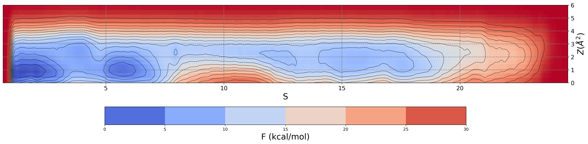
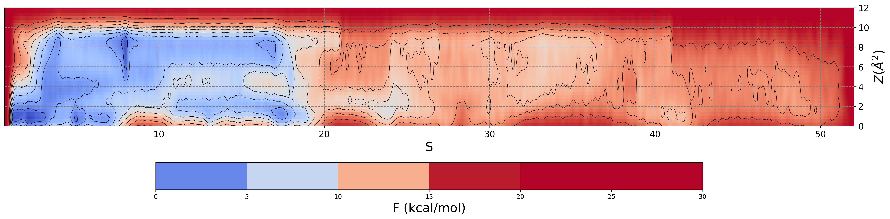

# Sampling the guessed path

We can use the parameterized guessed path in production simulations using any sampling method relying on the use of CVs. For instance, metadynamics (metad) simulations can be conducted to reconstruct the free energy surface in the Path CV space. Here, we will show how to set up a metad simulation leveraging Path CVs. Note that this is only an illustrative example, on how to set up and run the simulation, with no intention of achieving here a converged free energy surface. 

An important aspect here is that you may need to renumber the atom number column (second column) of the *REPARAM_FINAL.pdb* file. This is because the atom indices in *REPARAM_FINAL.pdb* are consistent with the lighter version of the system, i.e. no hydrogens, no membrane lipids, and no waters. Since we are now going to conduct a simulation of the whole system, atom information for the atoms inside the *REPARAM_FINAL.pdb*, particularly the atom index, need to be consistent with those in the whole system. Assuming we need to achieve such renumbering, we produce a *REPARAM_FINAL_renumber.pdb* file.

We now have all we need to set up a metad simulation. We will bias the $S(\mathbf{R})$ and $Z(\mathbf{R})$ CVs. We take metad simulation parameters from this publication: https://doi.org/10.1021/acs.jctc.9b00450
Specifically, we set Gaussian width to 0.1 for $S(\mathbf{R})$ and 1 $Å^2$ for $Z(\mathbf{R})$, Gaussian height to 0.2 kcal/mol, temperature to 310 K, bias factor to 15, and Gaussians deposition time  to 1 ps. Finally, we can re-sample remaining closer to the configurational space sampled by the original SMD that we have used to parameterize the guess path. To this end, we can limit the region of the phase space accessible during the simulation by placing a suitable ``UPPER_WALL`` on $Z(\mathbf{R})$, e.g. at 3.0 $Å^2$. Fill in the following plumed template to perform such a metad simulation:

```plumed
#SOLUTIONFILE=data/plumed_Metad.dat

MOLINFO STRUCTURE=__FILL__

WHOLEMOLECULES ENTITY0=__FILL__ ENTITY1=__FILL__

ca: CENTER ATOMS=730,741,751,763,782,798,815,822,1338,1349,1365,1379,1389,1400,1419,1443,2823,2844,2868,2874,2909,2928,3534,3554,3598
alp: CENTER ATOMS=28695-28736

d: DISTANCE ATOMS=ca,alp

p: PATHMSD REFERENCE=__FILL__  LAMBDA=__FILL__ NEIGH_STRIDE=4 NEIGH_SIZE=8

meta: METAD ARG=p.sss,p.zzz SIGMA=__FILL__,__FILL__ HEIGHT=__FILL__ TEMP=__FILL__ BIASFACTOR=__FILL__ PACE=__FILL__

uwall_z: UPPER_WALLS ARG=p.zzz AT=__FILL__ KAPPA=__FILL__
lwall_s_o: LOWER_WALLS ARG=p.sss AT=1  KAPPA=__FILL__
uwall_s_i: UPPER_WALLS ARG=p.sss AT=80 KAPPA=__FILL__

PRINT ARG=* STRIDE=500 FILE=colvar_metad.dat
```
To run the simulation with the GROMACS md engine, just enter:
```
gmx_mpi grompp -f md.mdp -c structure.gro -p box_system_GMX.top -o metad.tpr -maxwarn 2
mpirun -n 8 gmx_mpi mdrun -deffnm metad -plumed plumed_Metad.dat -ntomp 1
```
As in any metad simulation, plumed will produce a *HILLS* file, which you can use to reconstruct the free energy surface using the **``sum_hills``** module, as follows:

```
plumed sum_hills --hills HILLS --mintozero --kt 2.6
```
This results in a *fes.dat* file, that we can finally plot to visualize the reconstructed free energy surface. Here is the result of a 50 ns metad simulation:



In usual production scenarios, you may envisage a more generous exploration of the configurational space around the reference path. For instance, you can adapt the above plumed template to repeat the simulation with a larger ```UPPER_WALL```. Here is the resulting free energy surface using 9.0 $Å^2$, with the same simulation time of 50 ns:



Note that:

* Expanding the allowable range of $Z(\mathbf{R})$ for sampling might promote a broader, non-local search for additional routes along the reference path ($Z(\mathbf{R})=0$). As long as these routes remain reasonably close to it, they could suggest alternative and possibly more favourable mechanisms for the binding process.

* The further you go on $Z(\mathbf{R})$, the less meaningful and more degenerate will become the mapping on $S(\mathbf{R})$, so that sampling will become inconvenient and, most remarkably, less efficient the exploitation of your computational resources.

It is also important to note that the metad simulation time of 50 ns used here is solely intended for illustrative purposes, as no attempts have been made to assess the convergence of the free energy or evaluate the statistical error (the range covered by $S(\mathbf{R})$ was not even fully sampled!). We recommend dedicated Plumed Tutorials or Masterclasses for a thorough exploration of these issues. To provide an order of magnitude, a metad sampling of approximately 2 $\mu \text{s}$ was utilized in this study https://doi.org/10.1021/acs.jctc.9b00450 to obtain meaningful results.


