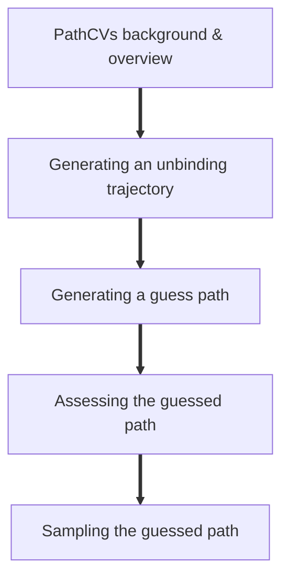

```mermaid
flowchart TD
A[PathCVs background & overview] ==> B[Generating an unbinding trajectory]
B ==> C[Generating a guess path]
C ==> D[Assessing the guessed path]
D ==> E[Sampling the guessed path]

click A "https://github.com/mbernett/tutorial_binding_path/blob/main/Intro.md" "A general introduction on path collective variables."
click B "https://github.com/mbernett/tutorial_binding_path/blob/main/SMD.md" "Generate a sample unbinding trajectory."
click C "https://github.com/mbernett/tutorial_binding_path/blob/main/Guess.md" "Parametrize a guess path."
click D "https://github.com/mbernett/tutorial_binding_path/blob/main/Check.md" "Qualitative check of guess path features."
click E "https://github.com/mbernett/tutorial_binding_path/blob/main/Metad.md" "Set up a metadynamics simulation to resample along the generated guess path."
```
