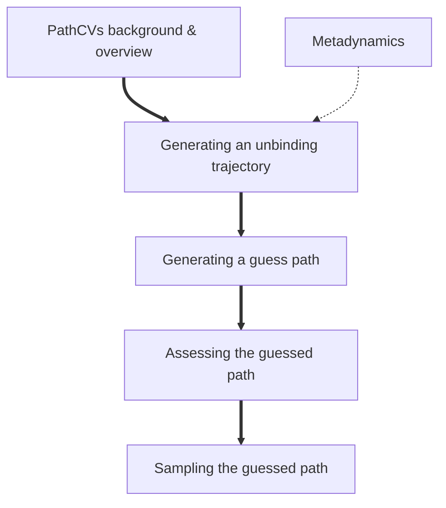

```mermaid
flowchart TD
A[PathCVs background & overview] ==> B[Generating an unbinding trajectory]
B ==> C[Generating a guess path]
C ==> D[Assessing the guessed path]
D ==> E[Sampling the guessed path]
F[Metadynamics] -.-> B

click A "Intro.md" "A general introduction on path collective variables."
click B "SMD.md" "Generate a sample unbinding trajectory."
click C "Guess.md" "Parameterize a guess path."
click D "Check.md" "Qualitative check of guess path features."
click E "Metad.md" "Set up a metadynamics simulation to resample along the generated guess path."
click F "ref1" "This lesson teaches you how to run metadynamics simulations."
```
