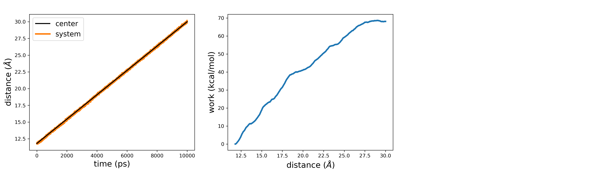
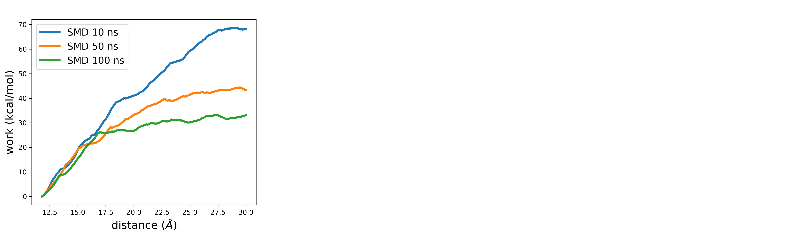

# Generating an unbinding trajectory

To generate a guess path for drug-target binding, we need the initial and final reference states along with a tentative sampling of the process. In most cases, the bound state of the drug-target complex is available either though known experimental structures or docking predictions. However, sampling the spontaneous drug-target dissociation with standard MD is usually impractical due to timescale issues. To overcome this limitation, one can leverage enhanced sampling methods. Herein, we resort to steered MD (SMD), though other equally valid alternatives, such as adiabatic-bias MD, are available.

As a test system to show the procedure for parameterizing a guess path, we take the complex between the drug alprenolol and the $\beta2$ adrenergic receptor, which was more extensively studied in this work: https://doi.org/10.1021/acs.jctc.9b00450 

Starting from the bound state of the complex, we pull along the distance between the ligand and the binding site. In particular, we take as CV the distance between the geometric centers of the low-fluctuating $\alpha$ carbons of the intra-membrane region of the receptor (ca) and the ligand's heavy atoms (alp). We do this in a 10 ns SMD simulation, where we increase the distance from its initial value to a target value of 30.0 Å and using a force constant of 100 kcal/(mol * $Å^2$). For the receptor's atoms, we can take the residue list from the published work. Fill in the following plumed template to perform the SMD simulation:

```plumed
#SOLUTIONFILE=data/plumed_SMD.dat
MOLINFO STRUCTURE=__FILL__

WHOLEMOLECULES ENTITY0=__FILL__ ENTITY1=__FILL__

ca: CENTER ATOMS=730,741,751,763,782,798,815,822,1338,1349,1365,1379,1389,1400,1419,1443,2823,2844,2868,2874,2909,2928,3534,3554,3598

alp: CENTER ATOMS=__FILL__

d: DISTANCE ATOMS=__FILL__

MOVINGRESTRAINT ...
   ARG=d
   STEP0=0 AT0=__FILL__ KAPPA0=__FILL__
   STEP1=__FILL__ AT1=__FILL__ KAPPA1=__FILL__
...

PRINT ARG=* STRIDE=500 FILE=colvar_SMD.dat
```

For the subsequent stages of the procedure, it is important to have a trajectory that finely catches the system progression along the process. To this end, we need to increase the saving frequency of MD snapshots. Setting a dumping frequency value of 1 ps in the MD engine should be reasonable for most applications. 

Once the simulation has completed, we can read the plumed output *colvar_SMD.dat*, which stores different quantities recorded during the simulation. For instance, we can inspect how strictly the system follows the SMD restraint, and the work as a function of the distance CV:



As a final consideration, note that while the distance between ligand and binding site increases, both the ligand, as well as the surrounding residues from the target, are free to explore different configurations. For this reason, it is good practice to perform a series of SMD simulations, and pick the one where the work associated with the process is lowest. In first approximation, this should better point to the minimum free energy path.
Additionally, the simulation parameters used herein were suitable to this illustrative example and may need readjustements for application of different systems. For instance, consider that different force constant values or simulation time may be required. As an exercise, we can perform a single replicate of SMD at increasing simulation times, e.g. 50 and 100 ns. If we compare the work as a function of the distance CV in the three simulations, we should obtain something like this:



As expected, allowing more time to the system for readjusting to more favorable configurations as we pull the ligand outside the binding site results in lower work.


